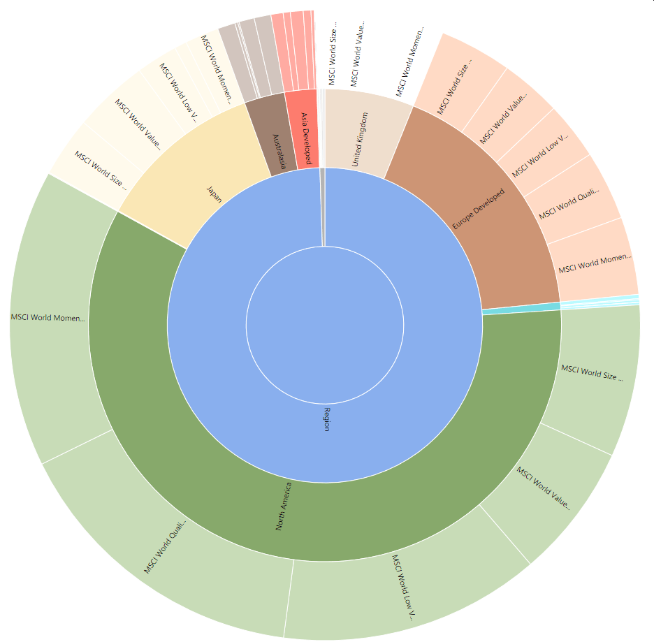
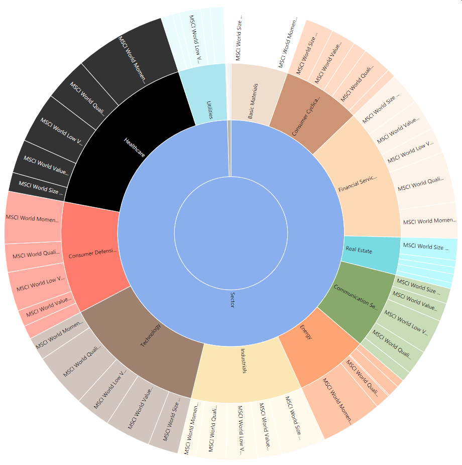

# pp-portfolio-classifier

Python script that automatically classifies Funds/ETFs managed in [Portfolio Performance](https://www.portfolio-performance.info/) files by the stock types, countries and industry sectors they are invested in. Furthermore it determines the Top 10 holdings of each fund. The classifier uses the information from morningstar as a data source for classification. It first tries to retrieve the information of the security from Morningstar itself and, if not found, it tries to use the x-ray service.
Based on the script by fbuchinger

## Warnings & Known Issues
- Experimental software - use with caution! 
- Check the [Portfolio Performance Forum thread](https://forum.portfolio-performance.info/t/automatic-import-of-classifications/14672) 

## Installation
requires Python 3, git and Portfolio Performance.
Steps:
1. `git clone` this repository
2. in the install directory run `pip3 install -r requirements.txt`
3. test the script by running `python portfolio-classifier.py test/multifaktortest.xml` to test the script. Then open the resulting file `pp_classified.xml` in Portfolio Performance.

## How it works:

**Important: Never try this script on your original Portfolio Performance files -> risk of data loss. Always make a copy first that is safe to play around with or create a dummy portfolio like in test folder.**

1. In Portfolio Performance, save a copy of your portfolio file as unencrypted xml. The script won't work with any other format.
1. Optionally, you can add a "secid" attibute to the security. Edit each security (Ctrl + E) and add a "secid" attribute on the attributes tab. The value of the attribute is the code at the end of the morningstar url of the security (the id of length 10 after the  "?id=", something like 0P00012345). If the security does not have the secid attribute, the script will try to get it from the morningstar website, but the script might have to be configured with the domain of your country, since not all securities area available in all countries. The domain is only important for the translation from isin to secid. Once the secid is obtained, the morningstar APIs are country-independent. It also caches the mapping into a file called isin2secid.json in order to reduce the number of requests.
3. Run the script `python portfolio-classifier.py <input_file> [<output_file>] [-d domain]` If output file is not specified, a file called pp_classified.xml will be created. If domain is not specified, 'es' will be used for morningstar.es. This is only used to retrieve the corresponding internal Morningstar id (secid) for each isin.
4. open pp_classified.xml (or the given output_file name) in Portfolio Performance and check out the additional classifications.

## Gallery

### Autoclassified stock-style

### Autoclassified Regions

### Autoclassified Sectors

